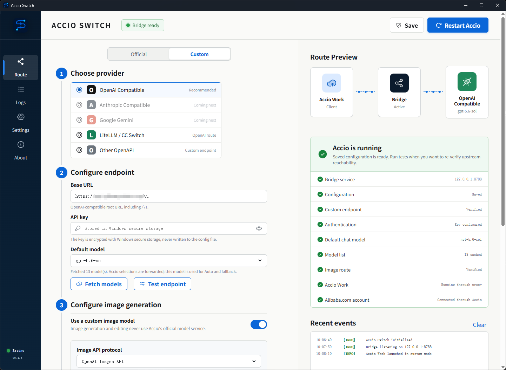
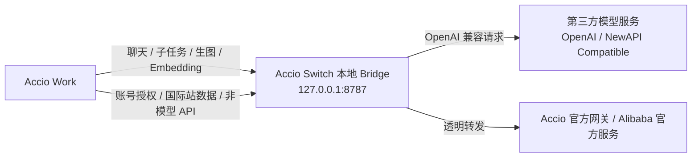

# Accio Switch

[](https://github.com/xyh9949/Accio-Switch/releases/latest)
[](https://github.com/xyh9949/Accio-Switch/releases/latest)
[](LICENSE)

**Accio Switch 是一款面向 Windows 的 Accio Work 本地路由工具。** 它在 Accio Work 与 OpenAI 兼容模型服务之间运行一个只监听本机的 Bridge，将受支持的聊天、子任务、生图和 Embedding 请求转换后发送到你配置的第三方接口，同时保留 Accio 的官方账号授权和业务数据能力。

> [!IMPORTANT]
> Accio Switch 是非官方开源项目，与 Alibaba.com、阿里巴巴集团及 Accio 官方没有隶属、合作或背书关系。它不会提供 API Key、模型额度、Alibaba.com 账号或 Accio Work 本体。



## 它解决什么问题

Accio Work 的桌面端使用自己的模型调用格式和流式响应协议。把一个 OpenAI 或 NewAPI 兼容地址直接填进普通代理软件，通常只能看到模型列表，却无法完整处理主任务、子任务、工具调用、生图或长时间运行的请求。

Accio Switch 不只是转发 HTTP 地址，它在本地完成以下适配：

- 向 Accio 提供可识别的模型列表和模型路由结果。
- 将 Accio 的对话、图片输入、工具声明和多轮工具结果转换为 OpenAI 兼容请求。
- 将第三方服务的 JSON 或 SSE 响应转换回 Accio 所需的 SSE 帧。
- 为耗时请求发送心跳，避免 Accio 因长时间没有数据而提前断开。
- 对过大的上下文和工具结果做渐进式压缩，并对部分临时上游错误重试一次。
- 单独处理聊天、生图和 Embedding 路由，而不是让它们被迫共用同一个模型。

整个 Bridge 只监听 `127.0.0.1`，正常使用不需要自己部署额外的 Accio Switch 服务器，但你仍然需要一个可访问的 OpenAI 兼容模型服务。

## 工作原理



| 流量类型 | Custom 模式下的去向 |
| --- | --- |
| 聊天、主任务、子任务 | 配置的 `/chat/completions` |
| Accio 中明确选择的模型 | 保留该选择并原样发送给第三方接口 |
| Accio 的 `Auto` 或自动模型路由 | 使用 Accio Switch 中配置的 Default model |
| Embedding | 同一聊天 Base URL 下的 `/embeddings` |
| 生图和图片编辑 | 独立图片接口，或按需复用聊天接口和 Key |
| Alibaba.com 账号授权、国际站经营数据和其他非模型 API | 通过 Bridge 透明转发到 Accio 官方服务 |

### 关于模型选择

从 `v0.4.6` 开始，模型优先级是：

```text
Accio 中明确选择的模型 > Accio Switch 的 Default model
```

Default model 只用于 Accio 选择 `Auto`、自动路由没有给出具体模型，或请求中没有模型名称的情况。因此可以在 Switch 中保存一个稳定的默认模型，再直接在 Accio 的模型下拉框中切换其他上游模型。

## 主要功能

- 支持 OpenAI 和 NewAPI 风格的兼容接口。
- 从上游 `GET /models` 获取并缓存模型列表。
- 支持 Accio 主任务、子任务、工具调用、图片输入和多轮工具结果。
- 支持第三方 JSON 响应与 SSE 流式响应。
- 聊天请求使用 SSE 心跳，降低长任务触发 Accio 180 秒连接超时的概率。
- 大型工具结果与超大上下文自动压缩，缓解部分提供商的 `504 Gateway Time-out`。
- 图片 Base URL、API Key、模型和协议可以与聊天配置完全独立。
- 图片支持 Chat Completions 多模态协议，以及 OpenAI Images API 的生成和编辑接口。
- Embedding 请求走自定义提供商，不回退到 Accio 官方模型服务。
- Custom 模式下，聊天和已启用的图片请求不会自动回退到 Accio 官方模型。
- 启动 Accio 后读取其 SDK 日志验证实际网关；发现仍连接官方模型网关时会停止 Accio，避免误用。
- 检查 Alibaba.com 官方账号授权状态，但不会代替用户登录或授权。
- 默认端口 `8787` 被占用时，自动在后续端口中寻找可用端口并保存结果。
- Endpoint 测试有 20 秒超时，不会无限转圈。
- 单实例运行，重复打开会唤起已有窗口。
- 关闭或最小化窗口后驻留系统托盘，可从右下角恢复或退出。
- API Key 使用 Electron `safeStorage` 和 Windows 安全存储加密。
- 支持静态 `latest.json` 更新源、SHA-256 校验和便携版 EXE 更新。

## 支持的上游接口

聊天 Base URL 通常应包含 `/v1`，例如：

```text
https://api.example.com/v1
```

Accio Switch 会按功能调用以下接口：

| 方法 | 路径 | 用途 | 必需性 |
| --- | --- | --- | --- |
| `GET` | `/models` | 获取聊天或图片模型列表 | 推荐；没有时可以手动填写模型 |
| `POST` | `/chat/completions` | 聊天、子任务、工具调用 | Custom 模式必需 |
| `POST` | `/embeddings` | Accio 的向量化请求 | 使用相关 Accio 功能时必需 |
| `POST` | `/chat/completions` | Chat Completions 多模态生图 | 选择该图片协议时必需 |
| `POST` | `/images/generations` | 文生图 | 选择 OpenAI Images API 时必需 |
| `POST` | `/images/edits` | 带参考图的图片编辑 | 选择 OpenAI Images API 且进行编辑时必需 |

“OpenAI Compatible”并不代表所有第三方实现完全一致。模型是否支持工具调用、图片输入、生图、足够长的上下文和正确的 SSE 格式，最终取决于上游提供商。

## 系统要求

- Windows 10 或 Windows 11，64 位。
- 已安装并能正常登录的 Accio Work 桌面端。
- 一个可用的 OpenAI 兼容或 NewAPI 兼容 Base URL、API Key 和模型额度。
- 若要使用图片功能，还需要支持对应图片协议的模型和额度。

当前主要兼容目标为 **Accio Work 0.16.1**。Accio 使用未公开的内部协议，升级 Accio 后可能需要等待本项目适配。

## 安装

1. 打开 [GitHub Releases](https://github.com/xyh9949/Accio-Switch/releases/latest)。
2. 下载最新的 `Accio-Switch-x.y.z.exe`。
3. 将 EXE 放在任意普通目录并直接运行，无需安装。
4. Windows SmartScreen 若提示未知发布者，请先核对文件来自本仓库 Release，并核对 Release 中公布的 SHA-256。

Accio Switch 当前是便携版应用，但配置与加密后的 Key 会保存在当前 Windows 用户的 `%APPDATA%\accio-switch`，因此移动 EXE 不会丢失配置。

## 快速开始

1. 先安装 Accio Work，并在 Accio 内完成 Alibaba.com 账号登录和官方授权。
2. 启动 Accio Switch，在顶部选择 `Custom`。
3. 在 `Base URL` 中填写包含 `/v1` 的接口地址。
4. 在 `API key` 中填写聊天接口的 Key。
5. 点击 `Fetch models`，然后选择一个 `Default model`；如果上游不支持 `/models`，也可以手动填写模型 ID。
6. 点击 `Test endpoint`。测试会向当前默认模型发送一个很小的 `Reply with OK.` 请求，并在 20 秒后超时。
7. 需要生图时，开启 `Use a custom image model`，选择图片协议，填写图片模型和独立 Key；只有确认额度共用时才开启 `Reuse chat API key`。
8. 点击右上角 `Save`。配置没有改动时，已保存状态会一直保留，不需要每次启动都重新测试。
9. 保持 `Auto-start bridge with Accio` 开启，然后点击 `Launch Accio`。Accio 已运行时按钮会显示 `Restart Accio`，以确保新的路由环境变量真正生效。
10. 等待右侧状态显示 `Running through proxy`。之后可以在 Accio 内明确选择任一已注入模型；选择 `Auto` 时使用 Switch 的 Default model。

> [!TIP]
> 修改 Base URL、Key、模型、端口或模式后，请保存并通过 Accio Switch 重启 Accio。仅在 Accio 内关闭窗口或直接重新打开，可能继续沿用旧进程中的路由配置。

## 配置说明

### 聊天配置

| 字段 | 说明 |
| --- | --- |
| `Official / Custom` | Official 直接使用 Accio 官方模型链路；Custom 启用本地 Bridge 和第三方接口 |
| `Provider` | 当前实际支持 OpenAI Compatible；界面中的 Anthropic Compatible 和 Google Gemini 仍是预留项 |
| `Base URL` | 第三方接口根地址，通常以 `/v1` 结尾 |
| `API key` | 聊天和 Embedding 使用的凭证，只在保存时写入 Windows 加密存储 |
| `Default model` | Accio 选择 Auto 或请求未指定模型时使用的模型 |
| `Fetch models` | 调用上游 `/models`，刷新 Accio 可见的模型列表 |
| `Test endpoint` | 实际调用一次 `/chat/completions`，验证 Key、模型和额度 |

### 图片配置

| 字段 | 说明 |
| --- | --- |
| `Use a custom image model` | 开启后，Accio 的生图和图片编辑请求必须走这里配置的第三方图片接口 |
| `Image API protocol` | `Chat Completions multimodal` 或 `OpenAI Images API` |
| `Image Base URL` | 留空时复用聊天 Base URL，也可以填写完全独立的图片服务地址 |
| `Image model` | 必须是实际支持生图或编辑的模型，聊天模型不会被自动复用 |
| `Reuse chat API key` | 开启后复用聊天 Key；关闭时使用独立 Image API key |
| `Test image endpoint` | 调用图片服务的 `/models` 并检查模型是否存在，不会实际生成图片 |

### Settings

| 字段 | 说明 |
| --- | --- |
| `Bridge port` | 本地 Bridge 首选端口，默认 `8787`；占用时会自动尝试后续端口 |
| `Official gateway` | 非模型请求的官方转发目标，通常不要修改 |
| `Accio executable` | `Accio.exe` 的绝对路径，默认指向 `%LOCALAPPDATA%\Programs\Accio\Accio.exe` |
| `Update feed URL` | 可选的静态 `latest.json` 地址 |
| `Check for updates on start` | 启动时检查更新源，不配置 URL 时不会联网检查更新 |

## 两种运行模式

### Custom

- 模型列表、聊天、子任务、Embedding，以及已启用的图片请求走第三方模型服务。
- 聊天和图片请求失败时不会静默回退到 Accio 官方模型。
- Alibaba.com 账号授权、经营数据工具和其他非模型接口仍转发给 Accio 官方服务。
- Accio 必须由 Accio Switch 启动或重启，Bridge 才能接管对应模型请求。

### Official

- 不启动自定义模型 Bridge 路由。
- Accio 使用自身官方配置和计费方式。
- 适合临时排查问题，或需要完全恢复 Accio 原始行为时使用。

## i豆与国际站数据的重要说明

Accio Switch 只能控制它已经识别并适配的模型、图片和 Embedding 请求，**不能也不会伪造 Alibaba.com 登录态、经营数据或业务权限**。

- “国际站生意助手”读取店铺、询盘、商品等数据时，仍需在 Accio 中连接并授权真实的 Alibaba.com 账号。
- 账号授权、业务工具、`workctl` 以及非模型 API 仍使用 Alibaba 和 Accio 的官方服务。
- 这些官方业务服务是否消耗 i豆，由 Alibaba/Accio 的产品规则决定，Accio Switch 无法保证“零 i豆”。
- 业务工具返回的数据如果进入模型上下文，相关内容会随模型请求发送给你配置的第三方提供商，请根据公司的数据合规要求选择上游服务。

如果目标是完全替代 Alibaba 官方业务数据接口，仅代理 LLM 请求并不能实现；那需要获得相应官方 API 权限并单独开发数据连接器。

## 本地数据与安全

默认数据目录：

```text
%APPDATA%\accio-switch
```

主要文件：

| 文件 | 内容 |
| --- | --- |
| `config.json` | Base URL、模型、端口、Accio 路径等非敏感配置，不包含明文 API Key |
| `provider-key.bin` | 使用 Electron `safeStorage` 加密后的聊天 Key |
| `image-provider-key.bin` | 使用 Electron `safeStorage` 加密后的独立图片 Key |
| `bridge.log` | Bridge 运行日志，常见 `sk-...` 形式的 Key 会被脱敏 |
| `updates/` | 通过应用内更新功能下载的便携版 EXE |

安全注意事项：

- Bridge 仅绑定 `127.0.0.1`，不会主动监听局域网地址。
- 加密文件通常只应由同一 Windows 用户解密，不要把整个数据目录作为团队配置包分发。
- 开源仓库和普通版本不内置任何公司 API Key。
- 第三方提供商会收到模型请求所需的提示词、图片、工具结果和上下文，请阅读其隐私与日志政策。
- 日志会做基础 Key 脱敏，但公开日志前仍应人工检查 URL、账号信息和上游错误正文。
- API Key 一旦出现在截图、聊天、提交历史或公开文件中，应立即在提供商后台撤销并重新生成。

## 更新源格式

应用内更新是可选功能。`latest.json` 至少需要包含 `version` 和 `url`：

```json
{
  "version": "0.4.6",
  "channel": "stable",
  "url": "https://github.com/xyh9949/Accio-Switch/releases/download/v0.4.6/Accio-Switch-0.4.6.exe",
  "sha256": "<填入发布文件的 SHA-256>",
  "notes": "Release notes",
  "mandatory": false,
  "minVersion": "0.4.0"
}
```

下载完成后，Accio Switch 会在清单提供 `sha256` 时验证文件，再允许启动新版本。公开使用时建议始终提供 SHA-256，并通过可信 HTTPS 地址托管清单和 EXE。

## 常见问题

### `Test endpoint` 一直转圈

`v0.4.6` 已加入 20 秒超时。若仍无法完成，请检查 Base URL 是否包含正确的 `/v1`、DNS 和代理网络是否可达、Key 是否有效、模型是否存在，以及上游是否真的实现 `/chat/completions`。

### `502 Bad Gateway` 中包含 `Provider HTTP 403` 或 `Insufficient account balance`

请求已经到达 Accio Switch 和第三方提供商。真正错误是上游账号余额不足、Key 无权限或渠道拒绝请求，Accio Switch 无法绕过提供商的计费和权限限制。

### `504 Gateway Time-out`

通常是上游模型处理超时、上下文太大或提供商网关限时。Accio Switch 会压缩超大工具结果并对部分临时 `5xx` 重试一次，但无法突破上游的硬性超时。可以换用更大上下文或更快的模型，并检查 NewAPI 渠道超时设置。

### `EADDRINUSE: address already in use 127.0.0.1:8787`

`v0.4.6` 会从首选端口开始自动查找后续可用端口并保存。若所有候选端口都被占用，请在 Settings 中改为其他端口，然后保存并通过 Switch 重启 Accio。

### Accio 能看到模型，但切换后请求仍使用 Default model

确认使用 `v0.4.6` 或更高版本，并通过 `Restart Accio` 重新启动。Accio 中明确选择的模型应被原样转发；只有 `Auto` 或请求未指定模型时才使用 Default model。可在 Logs 中查找 `Accio selected ...; Switch default is ...`。

### 后台完全看不到第三方模型请求

确认当前是 Custom 模式、Bridge 状态为 Ready、Accio 状态为 `Running through proxy`，并且 Accio 是通过 Switch 启动或重启的。`Running, proxy unverified` 表示进程存在，但当前网关没有通过验证。

### Accio 显示 Alibaba.com 未授权或读不到国际站数据

这不是模型 API Key 的权限。请在 Accio 内完成 Alibaba.com 官方账号连接，确认对应店铺、子账号和数据权限。Switch 只显示从 Accio SDK 日志中识别到的授权状态，不创建登录态。

### 图片模型测试通过，但实际生图失败

图片测试只验证 `/models` 和模型名称。实际请求还取决于协议：模型直接在 Chat Completions 返回图片时选择多模态协议；标准生图或带参考图编辑时选择 OpenAI Images API。还需确认上游支持 `/images/generations`、`/images/edits`、目标尺寸和返回的图片格式。

### 关闭窗口后找不到程序

程序会最小化到 Windows 右下角托盘。双击 Accio Switch 图标可恢复窗口，右键托盘图标可退出。重复运行 EXE 只会唤起已有实例。

## 从源码开发

推荐使用 Node.js 20 LTS 和 npm。

```powershell
git clone https://github.com/xyh9949/Accio-Switch.git
cd Accio-Switch
npm ci
npm run electron:dev
```

运行协议测试：

```powershell
npm test
```

构建 Windows 便携版：

```powershell
npm run electron:build
```

产物会写入：

```text
release\Accio-Switch-0.4.6.exe
```

`release/` 不纳入源码版本控制，正式二进制文件通过 [GitHub Releases](https://github.com/xyh9949/Accio-Switch/releases) 发布。

## 项目结构

```text
accio-switch/
├─ electron/                Electron 主进程、Bridge、协议转换和测试
├─ src/                     React 用户界面
├─ src-tauri/               早期 Tauri 实现，当前正式打包仍使用 Electron
├─ assets/                  应用和安装包图标
├─ scripts/                 Windows 便携版构建脚本
├─ docs/                    README 图片等公开文档资源
├─ package.json
└─ README.md
```

## 兼容性与限制

- 当前正式打包运行时是 Electron；`src-tauri/` 不是当前发布版本的入口。
- 当前只发布 Windows 便携版，没有 macOS、Linux 或移动端版本。
- Accio 的内部协议和启动日志格式不是稳定的公开 API，Accio 更新可能导致模型列表、路由验证、工具调用或生图失效。
- 第三方接口的“OpenAI 兼容”程度不同，本项目无法保证每个中转站、模型和渠道都能工作。
- 本项目不会绕过 Alibaba.com 的账号授权、业务权限、风控、配额或计费。

## 参与项目

发现问题时请在 [Issues](https://github.com/xyh9949/Accio-Switch/issues) 中提供：

- Accio Switch 版本和 Accio Work 版本。
- 使用的接口类型与模型名称，不要提交 API Key。
- 能复现问题的最短步骤。
- 已人工脱敏的 Switch 日志和错误信息。
- 问题发生在聊天、子任务、工具调用、Embedding、图片还是官方业务数据链路。

提交 Pull Request 前请运行 `npm test`，并保持修改范围与问题直接相关。

## License

Accio Switch 自身源码采用 [MIT License](LICENSE) 开源。Accio Work、Alibaba.com 服务、第三方模型、图标或商标仍分别受其所有者条款约束，MIT License 不授予这些第三方软件或服务的权利。

## 免责声明

本项目旨在用于技术学习、研究与合法的兼容性测试，具体许可范围以 [MIT License](LICENSE) 为准。本项目不授予使用者访问其无权访问的账号、数据或服务的权利，也不得用于绕过平台授权、计费、配额、风控或其他安全措施。

使用者必须确保对相关账号、数据、API 和设备拥有合法授权，并自行遵守所在地法律法规，以及 Alibaba.com、Accio 和第三方服务商的协议与政策。严禁将本项目用于侵犯隐私、非法获取数据、攻击服务或其他违法违规活动。

如果你不具备合法授权，请勿下载、运行或传播本软件，并立即删除本软件及其产生的相关数据。网络上常见的“下载后 24 小时内删除”说法不具有当然免责效力，也不能替代合法授权或法定合规义务。

本项目按“原样”提供。在适用法律允许的最大范围内，作者和贡献者不对软件的持续可用性、与未来 Accio 版本的兼容性、第三方接口、账号状态、数据安全、计费结果、业务结果或任何直接与间接损失承担责任。使用者应自行评估并承担使用本项目及第三方模型服务产生的风险和费用。
